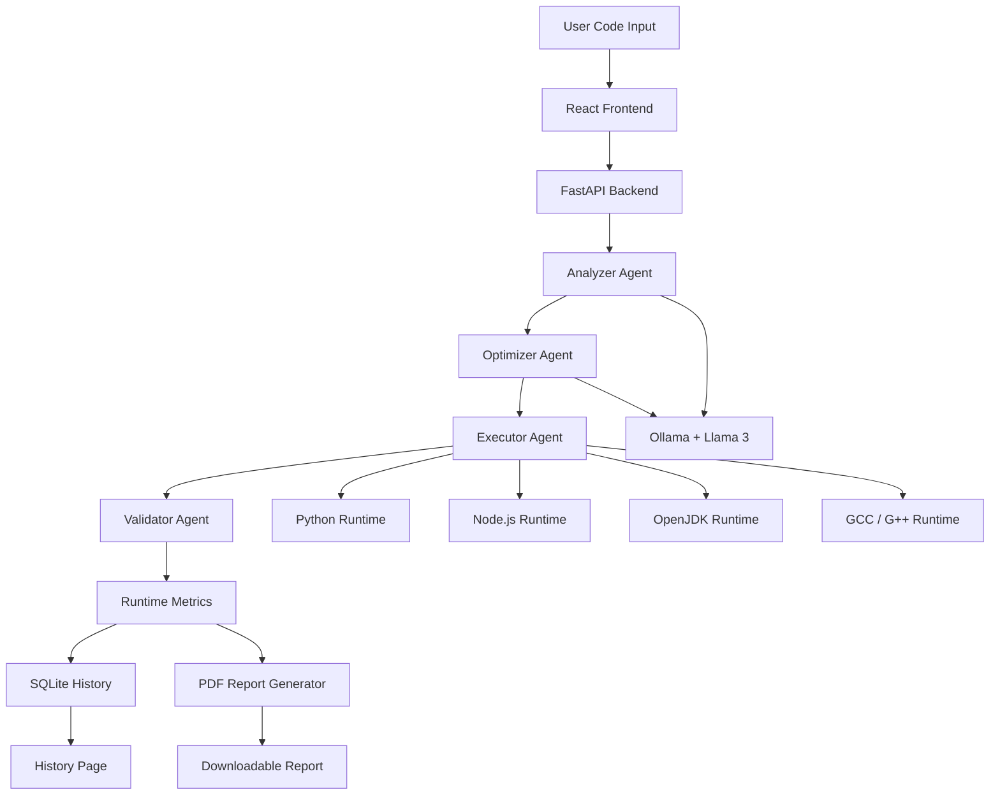

<!-- ========================================================= -->

<!--                     PERFMIND README                       -->

<!-- ========================================================= -->

<div align="center">

# ⚡ PerfMind

### 🧠 Agentic LLM System for Execution-Aware Multi-Language Code Performance Optimization


<br/>


<br/>


</div>

---

## 🎬 Project Overview

**PerfMind** is an AI-powered multi-language code performance optimization platform.

The system combines **Large Language Model reasoning** with **real execution feedback**. Instead of only suggesting optimized code, PerfMind executes both the original and optimized versions, compares runtime results, and validates whether the optimization is actually useful.

PerfMind follows an execution-aware workflow:

```text
Code Input → AI Analysis → Optimization → Execution → Validation → Report
```

The platform is designed for software engineering, performance analysis, academic research, and AI-assisted programming education.

---

## 🚀 Core Features

| Feature                   | Description                                                     |
| ------------------------- | --------------------------------------------------------------- |
| 🧠 AI Code Analysis       | Uses Llama 3 through Ollama to identify performance bottlenecks |
| ⚙️ Multi-Agent Pipeline   | Analyzer, Optimizer, Executor, and Validator agents             |
| 🧪 Real Code Execution    | Runs original and optimized code locally                        |
| 📊 Runtime Metrics        | Measures execution time, memory usage, gain, and saved time     |
| ✅ Validation Engine       | Accepts or rejects optimization using actual measured results   |
| 🌐 Multi-Language Support | Supports Python, JavaScript, Java, C, and C++                   |
| 🖥️ Monaco Editor         | Provides a VS Code-style coding experience                      |
| 📈 Runtime Charts         | Shows visual comparison of original and optimized execution     |
| 🔍 Code Diff Viewer       | Compares original and optimized code side by side               |
| 💬 AI Chat Assistant      | Answers follow-up questions about code and optimization         |
| 🧾 PDF Report Export      | Generates professional optimization reports                     |
| 🗃️ SQLite History        | Stores previous optimization runs                               |
| 🎨 Premium UI             | Dark cinematic dashboard with modern design                     |

---

## 🧩 System Architecture



---

## 🤖 Agentic Workflow

PerfMind uses four coordinated agents to complete the optimization pipeline.

### 🔎 1. Analyzer Agent

The Analyzer Agent examines the submitted code and identifies possible performance issues such as:

* nested loop overhead
* inefficient data structures
* repeated computations
* memory growth
* time complexity problems

### ⚡ 2. Optimizer Agent

The Optimizer Agent uses the LLM to generate an improved version of the code while trying to preserve the original functionality.

### 🧪 3. Executor Agent

The Executor Agent runs both the original and optimized programs using the correct local runtime environment.

### ✅ 4. Validator Agent

The Validator Agent compares the original and optimized execution results and decides whether the optimization should be accepted or rejected.

---

## 🛠️ Technology Stack

### Frontend

| Technology    | Purpose                   |
| ------------- | ------------------------- |
| React         | Web application interface |
| Monaco Editor | Code editor               |
| Axios         | API communication         |
| Recharts      | Runtime metric charts     |
| Lucide React  | Icons                     |
| CSS           | Premium cinematic styling |

### Backend

| Technology | Purpose                      |
| ---------- | ---------------------------- |
| FastAPI    | REST API backend             |
| Python     | Backend logic                |
| Ollama     | Local LLM runtime            |
| Llama 3    | AI analysis and optimization |
| SQLite     | History database             |
| ReportLab  | PDF report generation        |
| Uvicorn    | Backend server               |

### Runtime Support

| Language   | Runtime / Compiler |
| ---------- | ------------------ |
| Python     | Python Interpreter |
| JavaScript | Node.js            |
| Java       | OpenJDK            |
| C          | GCC                |
| C++        | G++                |

---

## 📁 Project Structure

```text
perfmind/
│
├── api.py
│
├── backend/
│   ├── database.py
│   ├── report_generator.py
│   ├── chat_agent.py
│   └── __init__.py
│
├── frontend/
│   ├── public/
│   │   └── index.html
│   │
│   ├── src/
│   │   ├── components/
│   │   │   ├── LiveAgentStream.js
│   │   │   ├── CodeDiffViewer.js
│   │   │   └── ChatAssistant.js
│   │   │
│   │   ├── pages/
│   │   │   ├── Dashboard.js
│   │   │   ├── History.js
│   │   │   ├── Analysis.js
│   │   │   ├── Optimization.js
│   │   │   ├── Metrics.js
│   │   │   ├── AgentMonitor.js
│   │   │   └── Settings.js
│   │   │
│   │   ├── App.js
│   │   ├── App.css
│   │   └── index.js
│   │
│   └── package.json
│
├── requirements.txt
├── README.md
└── .gitignore
```

---

## ⚙️ Installation Guide

### 1. Clone the Repository

```bash
git clone https://github.com/Bunny100806/PerfMind.git
cd PerfMind
```

---

## 🧠 Install and Run Ollama

Download and install Ollama from:

```text
https://ollama.com
```

Run Llama 3:

```bash
ollama run llama3
```

Keep this terminal running.

---

## 🐍 Backend Setup

Open a new terminal:

```powershell
cd C:\Users\saich\perfmind
```

Install backend dependencies:

```powershell
pip install -r requirements.txt
```

Run the FastAPI backend:

```powershell
py -3.13 -m uvicorn api:app --reload
```

Backend runs at:

```text
http://127.0.0.1:8000
```

---

## ⚛️ Frontend Setup

Open another terminal:

```powershell
cd C:\Users\saich\perfmind\frontend
```

Install frontend dependencies:

```powershell
npm install
```

Start the React application:

```powershell
npm start
```

Frontend runs at:

```text
http://localhost:3000
```

---

## ▶️ How to Use PerfMind

1. Open the dashboard.
2. Select a programming language.
3. Paste or upload source code.
4. Click **Run Analysis**.
5. View AI analysis.
6. Review optimized code.
7. Compare runtime metrics.
8. Check validation result.
9. Download the PDF report.
10. View previous runs in the History page.

---

## 🧪 Sample Python Test Code

```python
result = []

for i in range(2000):
    for j in range(2000):
        result.append(i * j)

print(len(result))
```

This example creates a large list using nested loops, making it useful for testing execution time and memory behavior.

---

## 📊 Output Metrics

PerfMind calculates and displays the following metrics:

| Metric                   | Meaning                                           |
| ------------------------ | ------------------------------------------------- |
| Original Execution Time  | Runtime of the submitted code                     |
| Optimized Execution Time | Runtime of the optimized code                     |
| Execution Saved          | Difference between original and optimized runtime |
| Memory Usage             | Approximate memory consumption                    |
| Optimization Gain        | Percentage improvement                            |
| Validation Status        | Accepted or rejected optimization                 |

---

## 🧾 PDF Report Export

PerfMind can generate a professional PDF report containing:

* AI analysis
* original code
* optimized code
* runtime metrics
* validation result
* optimization status

This makes the system useful for academic submission, project demonstration, and performance review.

---

## 🗃️ History Management

PerfMind stores previous analysis results using SQLite.

Each saved record contains:

* programming language
* original execution time
* optimized execution time
* memory values
* optimization status
* timestamp
* error messages if any

---

## 🔐 Safety and Execution Control

Since PerfMind executes user-submitted code, the system includes basic execution safety mechanisms:

* timeout control
* restricted execution rules
* controlled runtime execution
* unsafe command blocking where applicable
* validation before accepting optimization

These controls reduce the risk of unsafe or harmful code execution during testing.

---

## 🎯 Research Contribution

PerfMind contributes a practical execution-aware approach to AI-assisted code optimization.

The main contribution is the integration of:

```text
LLM Reasoning + Multi-Agent Coordination + Runtime Execution + Validation Feedback
```

This makes optimization more reliable because the system validates AI-generated improvements using measured execution results instead of static assumptions.

---

## 📌 Project Highlights

```text
✅ Full-stack implementation
✅ Local LLM integration
✅ Multi-agent workflow
✅ Multi-language runtime support
✅ Runtime-based validation
✅ SQLite history storage
✅ PDF report generation
✅ AI chat assistant
✅ Professional academic use case
```

---

## 🎥 Demo Flow

Recommended video demonstration order:

```text
1. Start Ollama
2. Start FastAPI backend
3. Start React frontend
4. Open dashboard
5. Select language
6. Paste code
7. Run analysis
8. Show AI analysis
9. Show optimized code
10. Show runtime metrics
11. Show code diff viewer
12. Ask AI chat assistant a question
13. Download PDF report
14. Open History page
15. Show GitHub repository
```

---

## 👨‍💻 Authors

### 👨‍🎓 Sai Charitharth Nadigoti

**B.Sc. Computer Engineering**
AFiB Vistula, Warsaw, Poland

### 👨‍🎓 Ayan Shaikh

**B.Sc. Computer Engineering**
AFiB Vistula, Warsaw, Poland

### 🎓 Supervisor

**Prof. Kumar Nalinaksh**
Assistant Professor
AFiB Vistula, Warsaw, Poland

---

## 🌐 Repository

```text
https://github.com/Bunny100806/PerfMind
```

---

## 🏁 Conclusion

PerfMind demonstrates how large language models can be combined with real execution tools and agent-based coordination to support practical software performance optimization.

The system does not blindly accept AI-generated code. Instead, it executes, measures, compares, validates, stores, and explains optimization results.

This makes PerfMind a reliable and practical AI-assisted platform for performance analysis, code optimization, and software engineering education.

---

<div align="center">

# ⚡ PerfMind

### Think. Optimize. Execute. Validate.


</div>
